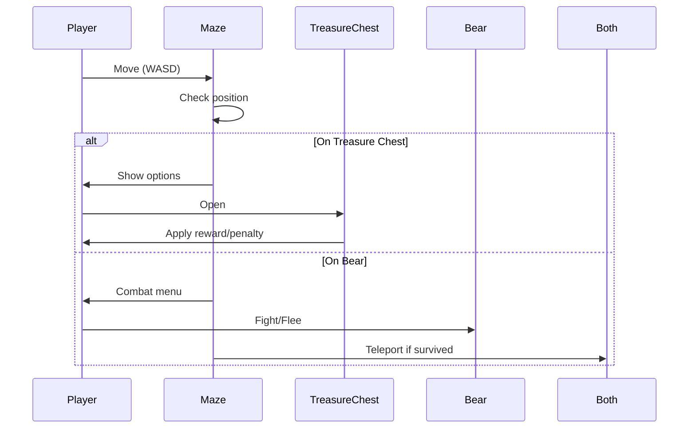

# Adventure Game - Readme Documentation

## Overview
This document provides a comprehensive overview of the Adventure Game's architecture, classes, and their interactions. The game features a player navigating a maze with treasure chests and a roaming bear, with luck-based rewards and combat mechanics.

## Class Structure

### Player (`Player.cs`)
**Represents the player character.**

**Attributes:**
- `Name` (string): The player's name.
- `Health` (int): Current health points.
- `Strength` (int): Attack strength.
- `Luck` (int): Luck score (0-10) affecting treasure outcomes.

**Methods:**
- `DisplayStats()`: Shows the player's current stats.

### Bear (`Bear.cs`)
**Represents the enemy bear.**

**Attributes:**
- `Health` (int): Current health points.
- `Strength` (int): Attack strength.
- `Luck` (int): Luck score (unused in current implementation).

**Methods:**
- `DisplayStats()`: Shows the bear's current stats.
- `OpenChest(TreasureChest chest)`: Allows the bear to interact with treasure chests.

### TreasureChest (`TreasureChest.cs`)
**Handles reward/penalty logic for chest interactions.**

**Attributes:**
- `_random` (Random): Random number generator.

**Methods:**
- `Open(Player player)`: Player interaction with chest.
- `Open(Bear bear)`: Bear interaction with chest.
- `ApplyRewardOrPenalty(dynamic character)`: Core logic for stat changes (uses player's Luck).

### Maze (`Maze.cs`)
**Manages the game world and interactions.**

**Attributes:**
- `GridSize` (const int): Maze dimensions (10x10).
- `_player`, `_bear`: References to game entities.
- `_treasureChests`: List of chests in the maze.
- Position tracking for player, bear, and chests.

**Key Methods:**
- `Explore()`: Main game loop.
- `MovePlayer()`, `MoveBear()`: Handle movement.
- `CheckForEvents()`: Detects collisions.
- `EncounterBear()`: Combat/escape logic.
- `TeleportPlayerAndBear()`: Repositions both after encounters.

### Game (`Game.cs`)
**Coordinates the game flow.**

**Methods:**
- `Start()`: Initializes and begins the maze exploration.

### Program (`Program.cs`)
**Entry point.**
- Creates player, bear, and game instances.

## Key Game Mechanics

### Treasure Chests
- Chests provide random boosts (health/strength/luck) or penalties.
- **Luck Influence**: Player's Luck (0-10) determines boost probability:
  - Luck 0 → 0% boost chance
  - Luck 10 → 100% boost chance

### Combat System
1. **Fight**: Player and bear deal damage equal to their Strength.
2. **Escape**: Success depends on player's Luck.

### Teleportation
After player-bear encounters, both teleport to random empty maze locations.

## How to Play
1. Move using WASD/arrow keys.
2. Find and open treasure chests (risk/reward).
3. Avoid or fight the bear.
4. Defeat the bear to win.

## Example Sequence

## Dependencies
- .NET Core 3.1+
- Input via console (WASD/arrows)

---

This documentation covers all key aspects of the game's architecture. For implementation details, refer to the source code comments.
